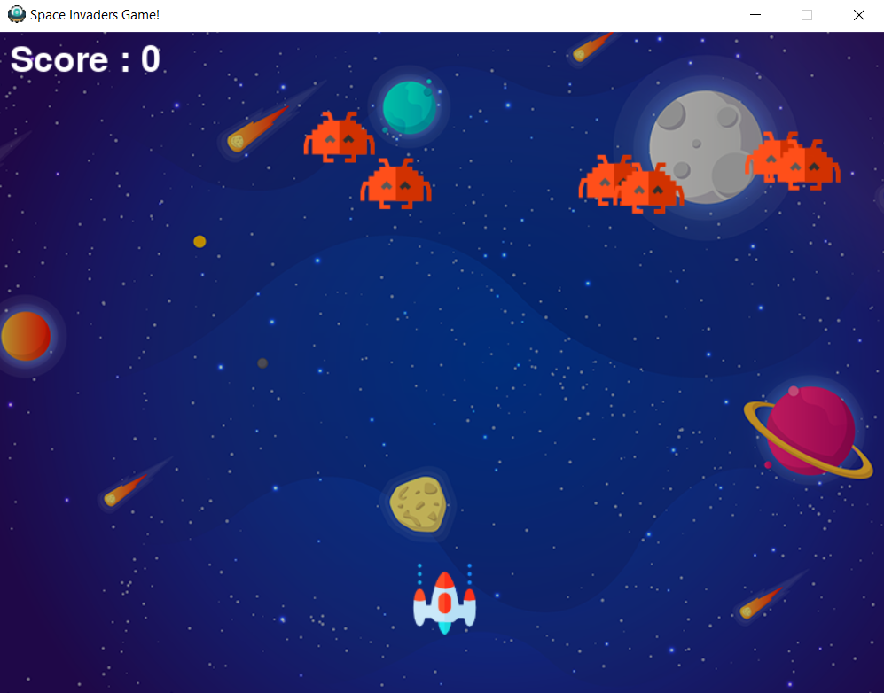
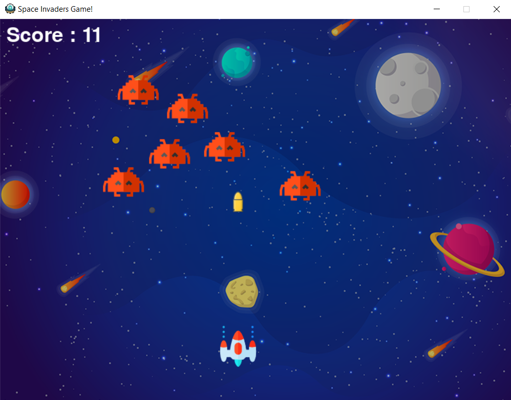
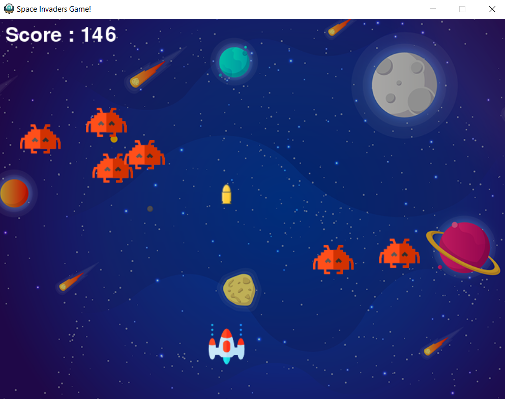

# Space Invaders Game
[](LICENSE)


This is a simple snake game written in Python With Pygame module.<br>
Click <a href="https://www.pygame.org/docs/"> here</a> to read more about **pygame** module.

## #100daysofcode
Almost a hundred days ago from now (01/10/2020), I decided to do the #100daysofcode challenge. This challenge is simply for someone to code every day and post on social media a picture shows that he wrote a code (every day). And than they share with us the final project.<br>
But me..! I did it differently, every day I built an app, a game, a web page or a desktop app. Every day something new and I shared all my apps simulation on my Instagram account (you can see my highlight stories), click <a href='https://instagram.com/medyanis_hiou'>here</a> if you wanna see it. And than I'll mix all my small apps in one big project. So I decided to share all projects with you.<br>

## Features :dart:
* [x] Free & Open Source
* [x] Very Easy to use
* [x] No Internet connection required

## Thank _You_!
Please :star: this repo to help us improve the quality.

## Screenshots
Begin           | playing XD
:---------------------:|:------------------:
 | 
Game Over


## Requirements
* python
* pygame module

## How To Use It
1. Download Python from this link: https://www.python.org/downloads/
2. Install the packeges, write in your command (cmd):
```bash
pip install pygame
pip install random
```
3. Install this repository, click <a href="https://github.com/mohamedyanis/space-invaders-game/archive/master.zip"> here </a> to install it.
4. Extract the folder.
5. Run the ```space_invaders_game.py``` file.

## Contributing 💡
If you want to contribute to this project and make it better with new ideas, your pull request is very welcomed.<br>
If you find any issue just put it in the repository issue section, thank you.<br><br>
.سبحَانَكَ اللَّهُمَّ وَبِحَمْدِكَ، أَشْهَدُ أَنْ لا إِلهَ إِلأَ انْتَ أَسْتَغْفِرُكَ وَأَتْوبُ إِلَيْكَ
